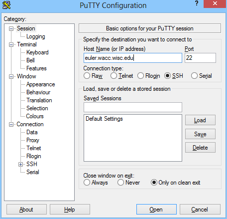
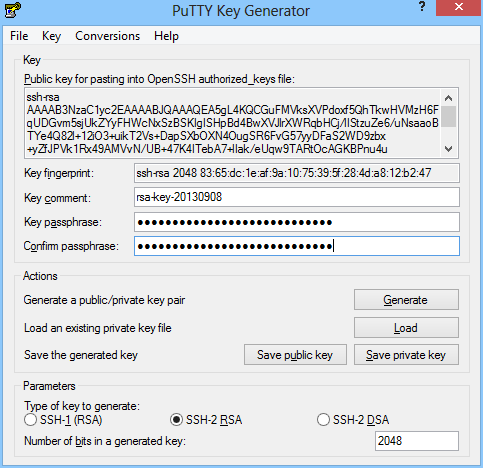

===============
Accessing Euler
===============

Euler is accessible via SSH at hostname ``euler.wacc.wisc.edu``. Accounts for research projects may be requested by contacting `Dan Negrut <http://homepages.cae.wisc.edu/~negrut/>`_.

The following describes how to log in from various operating systems.

---------------------
Linux / MacOSX / Unix
---------------------
Most Unix-like systems include an SSH client. To access Euler, simply open the terminal and type ``ssh username@euler.wacc.wisc.edu``, replacing ``username`` with the one provided to you.

::

    macosx:~ demo$ ssh demo@euler.wacc.wisc.edu
    demo@euler.wacc.wisc.edu's password:
    Creating directory '/home/demo'.
    [demo@euler ~]$

-------
Windows
-------
`PuTTY <http://www.chiark.greenend.org.uk/~sgtatham/putty/>`_ is one of the most popular SSH clients for Windows. The installer version is preferred as it includes a few utilities that will be used later (PuTTYGen).

To use PuTTY, enter the server hostname (``euler.wacc.wisc.edu``) and click `Open`.

::

    login: demo
    demo@euler.wacc.wisc.edu's password:
    [demo@euler ~]$

-----------------------------------
Key-Based Authentication (Optional)
-----------------------------------
Public key-based authentication allows you to access resources without explicitly entering a password every time. This section is optional and is not required in order to access Euler.

Linux / MacOSX / Unix
---------------------
OpenSSH-based clients typically include a command named ``ssh-keygen`` which is used to generate the private and public keys. Once generated, the public key can be copied to the server using ``ssh-copy-id``. 

.. note:: MacOSX does not ship with ``ssh-copy-id``; a copy is available here: `ssh-copy-id <https://gist.github.com/andrewseidl/6488345>`_.

On Linux:

::

    [demo@linux ~]$ ssh-keygen
    Generating public/private rsa key pair.
    Enter file in which to save the key (/home/demo/.ssh/id_rsa):
    Created directory '/home/demo/.ssh'.
    Enter passphrase (empty for no passphrase):
    Enter same passphrase again:
    Your identification has been saved in /home/demo/.ssh/id_rsa.
    Your public key has been saved in /home/demo/.ssh/id_rsa.pub.
    [demo@linux ~]$ ssh-copy-id demo@euler.wacc.wisc.edu
    demo@euler.wacc.wisc.edu's password:

    Number of key(s) added: 1

    Now try logging into the machine, with:   "ssh 'demo@euler.wacc.wisc.edu'"
    and check to make sure that only the key(s) you wanted were added.

On MacOSX:

::

    macosx:~ demo$ ssh-keygen
    Generating public/private rsa key pair.
    Enter file in which to save the key (/Users/demo/.ssh/id_rsa):
    Enter passphrase (empty for no passphrase):
    Enter same passphrase again:
    Your identification has been saved in /Users/demo/.ssh/id_rsa.
    Your public key has been saved in /Users/demo/.ssh/id_rsa.pub.
    macosx:~ demo$ curl -o ssh-copy-id https://gist.github.com/andrewseidl/6488345/raw/bffde4ea5cf23eebd8b0f4ee15708a0a9d0af7f5/ssh-copy-id
    macosx:~ demo$ less ssh-copy-id # inspect to make sure nothing changed
    macosx:~ demo$ chmod +x ssh-copy-id
    macosx:~ demo$ ./ssh-copy-id demo@euler.wacc.wisc.edu
    demo@euler.wacc.wisc.edu's password:
    Now try logging into the machine, with "ssh 'demo@euler.wacc.wisc.edu'", and check in:

      .ssh/authorized_keys

    to make sure we haven't added extra keys that you weren't expecting.

Windows
-------
In Windows, use the program `PuTTYgen <http://www.chiark.greenend.org.uk/~sgtatham/putty/>`_ to generate the keys, saving the private key to a safe place. Copy the public key to the clipboard.

Next, log in to Euler as you normally would using PuTTY. Create a file named ``~/.ssh/authorized_keys`` which contains the public key you copied from PuTTYgen (right-click in PuTTY is mapped to paste).

::

    [demo@euler ~]$ mkdir ~/.ssh && chmod 700 ~/.ssh
    [demo@euler ~]$ cat >> ~/.ssh/authorized_keys << EOF
    ssh-rsa AAAAB3NzaC1yc2...0seOoxPfSAwlQ== rsa-key-20130908
    EOF
    [demo@euler ~]$ chmod 600 ~/.ssh/authorized_keys

Finally, configure PuTTY to automatically send your username and the key. In a new session, set your username in `Connection > Data > Auto-login username` and select your private key in `Connection > SSH > Auth > Private key`. Return to `Session`, re-enter the hostname, enter a name under `Saved Sessions`, and hit `Save`. Double clicking on the session name should then automatically log you in to Euler.

------------------------
Remote X Sessions via NX
------------------------
It is sometimes desirable to use X11-/GUI-based programs from Euler. While Unix-like systems can forward this programs directly using ``ssh -X``, Windows users typically need to install and configure an X server such as `Xming <http://www.straightrunning.com/XmingNotes/>`_. Alternatively, Euler allows users to create a remote X session using `NoMachine NX <http://www.nomachine.com>`_.

.. warning:: NX on Euler should be considered unsupported and legacy. It may not always work and may be replaced in the future.

To begin, download and install the `NoMachine 4 Beta Client <http://www.nomachine.com/download-beta.php>`_ for your system. While that is installing, login to Euler via SSH and run ``cat /home/nx/client.id_dsa.key`` to get a copy of NX's key. Save this to a file on your machine.

Next, open NoMachine and click the icon for `Add a computer`. Give the session a name ("Euler"), set the protocol to 'SSH', and enter the hostname (``euler.wacc.wisc.edu``). Click `Advanced` and select `Use the NoMachine login`. Click `Continue` and select the file you just created with NX's key. Click `Continue` to finish.

You should now be on a summary page with the new connection. Click `Connect` and enter your Euler login details. Once connected, click `Create a new virtual desktop` and select `Create a new GNOME virtual desktop`. After clicking `Continue` you should be presented with a desktop running on Euler where you can use GUI-based programs.

.. note:: Please remember to logout once you no longer require a desktop. NX is very resource-intensive compared to the terminal, which may cause issues if too many people are using it at once.
